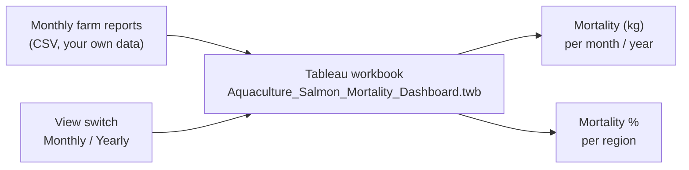

# Aquaculture Salmon Mortality Dashboard (Tableau)

A reusable Tableau workbook that shows the mortality of farmed Atlantic salmon over time and by
region, in kilograms and as a percentage of the biomass on site. It works with monthly farm reports,
one row per farm site per month.

**No data are included in this repository.** The workbook (`.twb`) contains only the design of the
dashboard: sheets, calculations, filters and layout. To use it, connect it to your own file with the
columns listed below.

## The dashboard

`Dashboard 1` combines the following elements:

| Element | What it shows |
|---|---|
| Dynamic main title | "Monthly Mortality (Kg)" or "Yearly Mortality (Kg)", depending on the selected view |
| Monthly Mortality (kg) | total mortality per month |
| Yearly Mortality (kg) | total mortality per year |
| Dynamic region title | "Monthly Mortality by Region" or "Yearly Mortality by Region" |
| Monthly Mortality % by Region | mortality as a percentage of the biomass on site, per local authority and month |
| Yearly Mortality % by Region | the same per local authority and year |
| View switch (parameter) | switches the whole dashboard between Monthly View and Yearly View |
| Filters | date, water type and region |

When the Yearly View is selected, the month filter is blocked, so that only yearly totals are shown.



## Calculations

| Field | Calculation |
|---|---|
| Mortality Rate (%) | `SUM(mortality kg) / (SUM(actual biomass t) × 1000) × 100` |
| Monthly Mortality Rate % | per month and local authority: total mortality (kg) divided by the average actual biomass (t × 1000), × 100 |
| Yearly Mortality Rate by Region (%) | the same per year and local authority |
| Country | corrects the spelling "Soctland" in the source data to "Scotland" |
| Show Monthly / Show Yearly | show or hide sheets depending on the selected view |

## Data the workbook expects

One row per farm site per month. The column names must match exactly.

| Column | Type | Description |
|---|---|---|
| `SampleNumber` | integer | report identifier |
| `MortalitiesKilograms` | number | mortality in the month (kg) |
| `ActualBiomass` | integer | biomass on site (tonnes) |
| `BiomassExceedenceTonnes` | integer | biomass above the allowed maximum (tonnes) |
| `FeedKilograms` | integer | feed used in the month (kg) |
| `MaximumBiomassAllowed` | integer | maximum biomass allowed on site (tonnes) |
| `WaterType` | text | Seawater or Freshwater |
| `LocalAuthority` | text | region of the farm site |
| `Country` | text | country |
| `Lab_Reference` | integer | data source reference |
| `FlooredDate` | date | first day of the reporting month |
| `Month` | integer | month (1–12) |
| `Year` | integer | year |

## How to reuse it

1. Prepare a CSV file with the columns above, for example `data/salmon_monthly_reports.csv`.
2. Open `workbook/Aquaculture_Salmon_Mortality_Dashboard.twb` in Tableau Desktop.
3. Tableau asks for the missing data file: point it to your CSV. Or use **Data → Replace Data Source**.
4. Open `Dashboard 1`. All sheets, calculations and filters work with the new data.

## How to read the dashboard

**1. Choose the view.** The view switch at the top sets the time scale for the whole dashboard.
In the Monthly View, the charts show one value per month; in the Yearly View, one value per year,
and the month filter is blocked. The titles change with the selection.

**2. Mortality in kilograms.** The upper chart shows the total weight of fish that died in each
month or year. It shows when mortality was high, but it does not take the size of the farms into
account: a region with more fish on site will usually also have more mortality in kilograms.

**3. Mortality as a percentage of biomass.** The lower chart divides the mortality by the biomass on
site, per region. This makes regions and periods comparable, because a large and a small farming
region are expressed on the same scale. A region with a high percentage lost a larger share of its
fish, even if its mortality in kilograms is lower than elsewhere.

**4. Filter.** The filters for date, water type and region update all charts at the same time. For
example, selecting Seawater shows marine farm sites only, and selecting one region shows its trend
over time.

## Files

```
workbook/Aquaculture_Salmon_Mortality_Dashboard.twb   Tableau workbook (no data)
```

## Related work

- Livestock Health Ontology: https://github.com/decide-project-eu/LivestockHealthOntology
- SHACL validation of LHO data: https://github.com/sabanoor8867/SHACL-Validation

## License

The workbook is released under CC BY 4.0.

## Author

Saba Noor, Ghent University.
