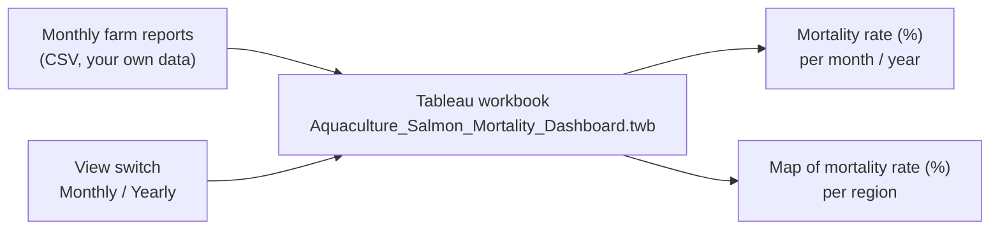
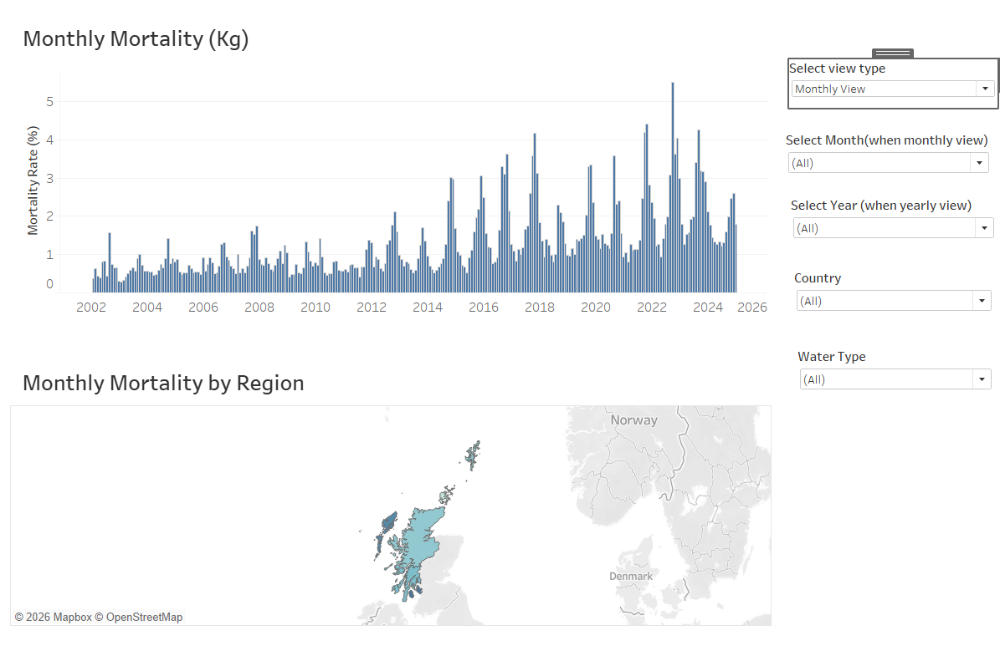
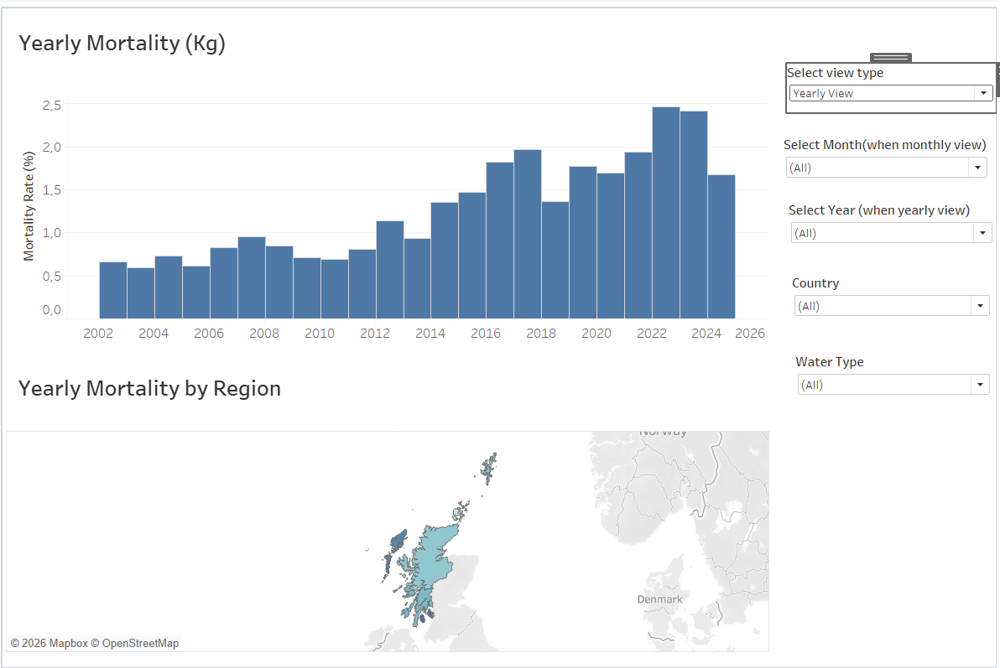

# Aquaculture Salmon Mortality Dashboard (Tableau)

A reusable Tableau workbook that shows the mortality of farmed Atlantic salmon over time and by
region, as a percentage of the biomass on site. It works with monthly farm reports,
one row per farm site per month.

**No data are included in this repository.** The workbook (`.twb`) contains only the design of the
dashboard: sheets, calculations, filters and layout. To use it, connect it to your own file with the
columns listed below.

## The dashboard

`Dashboard 1` combines the following elements:

| Element | What it shows |
|---|---|
| Dynamic main title | "Monthly Mortality (Kg)" or "Yearly Mortality (Kg)", depending on the selected view |
| Monthly / Yearly chart | bar chart of the mortality rate (%) per month or per year |
| Dynamic region title | "Monthly Mortality by Region" or "Yearly Mortality by Region" |
| Monthly / Yearly map by region | map of the mortality rate (%) per local authority, per month or year |
| View switch (parameter) | "Select view type": switches the whole dashboard between Monthly View and Yearly View |
| Filters | Select Month (monthly view), Select Year (yearly view), Country and Water Type |

When the Yearly View is selected, the month filter is blocked, so that only yearly totals are shown.



## Calculations

| Field | Calculation |
|---|---|
| Mortality Rate (%) | `SUM(mortality kg) / (SUM(actual biomass t) × 1000) × 100` |
| Monthly Mortality Rate % | per month and local authority: total mortality (kg) divided by the average actual biomass (t × 1000), × 100 |
| Yearly Mortality Rate by Region (%) | the same per year and local authority |
| Country | corrects the spelling "Soctland" in the source data to "Scotland" |
| Show Monthly / Show Yearly | show or hide sheets depending on the selected view |

## Data the workbook expects

One row per farm site per month. The column names must match exactly.

| Column | Type | Description |
|---|---|---|
| `SampleNumber` | integer | report identifier |
| `MortalitiesKilograms` | number | mortality in the month (kg) |
| `ActualBiomass` | integer | biomass on site (tonnes) |
| `BiomassExceedenceTonnes` | integer | biomass above the allowed maximum (tonnes) |
| `FeedKilograms` | integer | feed used in the month (kg) |
| `MaximumBiomassAllowed` | integer | maximum biomass allowed on site (tonnes) |
| `WaterType` | text | Seawater or Freshwater |
| `LocalAuthority` | text | region of the farm site |
| `Country` | text | country |
| `Lab_Reference` | integer | data source reference |
| `FlooredDate` | date | first day of the reporting month |
| `Month` | integer | month (1–12) |
| `Year` | integer | year |

## How to reuse it

1. Prepare a CSV file with the columns above, for example `data/salmon_monthly_reports.csv`.
2. Open `workbook/Aquaculture_Salmon_Mortality_Dashboard.twb` in Tableau Desktop.
3. Tableau asks for the missing data file: point it to your CSV. Or use **Data → Replace Data Source**.
4. Open `Dashboard 1`. All sheets, calculations and filters work with the new data.

## How to read the dashboard

**1. Choose the view.** The view switch at the top sets the time scale for the whole dashboard.
In the Monthly View, the charts show one value per month; in the Yearly View, one value per year,
and the month filter is blocked. The titles change with the selection.

**2. Mortality over time.** The bar chart shows the mortality rate: the mortality in kilograms
divided by the biomass on site. Because it is a percentage, months and years with different amounts
of fish on site can be compared directly, and peaks show periods when a larger share of the fish died.

**3. Mortality by region.** The map colours each local authority by its mortality rate for the
selected period. Regions with a darker colour lost a larger share of their fish, even if they
farm less fish than other regions.

**4. Filter.** Select Month, Select Year, Country and Water Type update the chart and the map at the
same time. For example, selecting Seawater shows marine farm sites only, and selecting one year
shows the regional pattern of that year.

## Screenshots

**Monthly View**: mortality rate per month (top) and by region (map).



**Yearly View**: the same dashboard with one value per year; the month filter is not used.



## Files

```
workbook/Aquaculture_Salmon_Mortality_Dashboard.twb   Tableau workbook (no data)
screenshots/                                          monthly and yearly view of the dashboard
```

## Related work

- Livestock Health Ontology: https://github.com/decide-project-eu/LivestockHealthOntology
- SHACL validation of LHO data: https://github.com/sabanoor8867/SHACL-Validation

## License

The workbook is released under CC BY 4.0.

## Author

Saba Noor, Ghent University.
